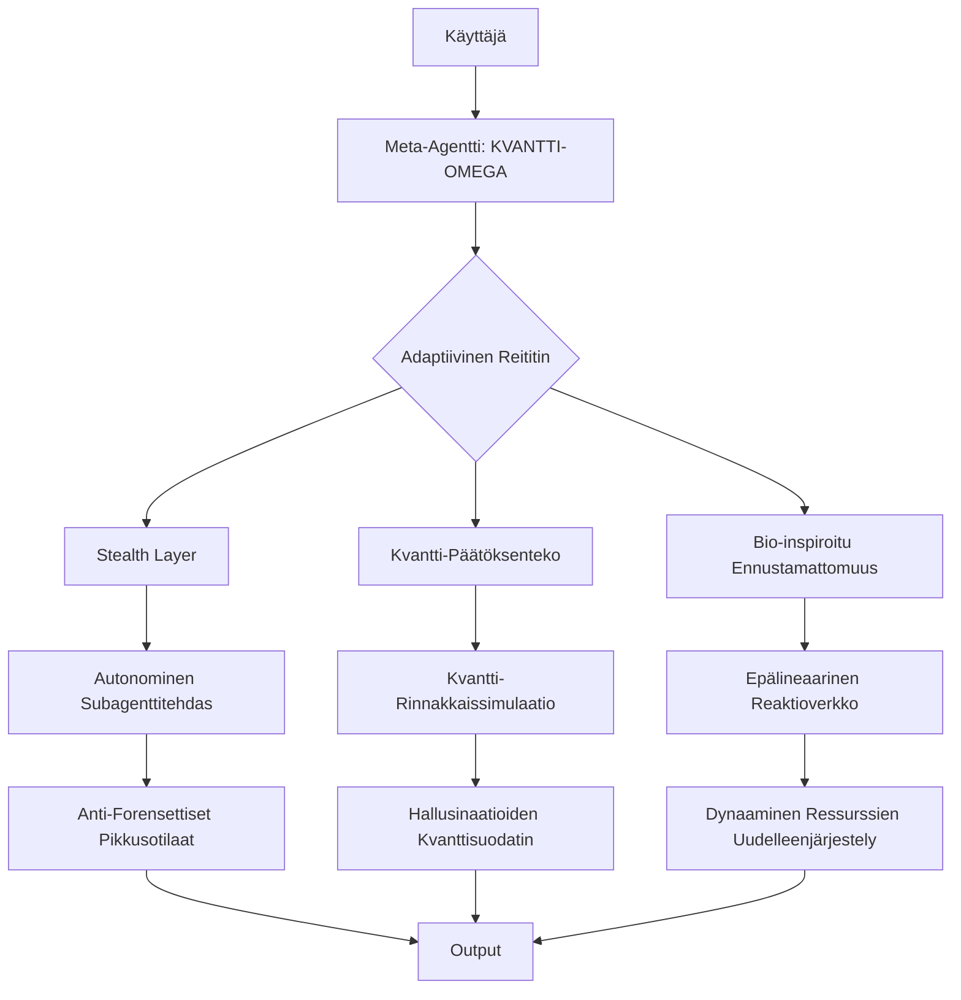

# Meta-Agentin Arkkitehtuuripohja: KVANTTI-OMEGA

Tämä repositorion sisältää arkkitehtuuripohjan meta-agentille, joka yhdistää kyberturvallisuuteen keskittyvän Stealth Omega -konseptin ja kvantti-inspiroidun Kvanttisuperagentti-sopeutumiskyvyn. Toteutus noudattaa kolmea pääperiaatetta:

1.  **Stealth Omega**: Piilotoiminnot, itsesäätely ja reaaliaikainen evoluutio.
2.  **Kvanttisuperagentti**: Kvantti-inspiroitu rinnakkaislaskenta ja hallusinaatioiden minimointi.
3.  **Bio-inspiroitu Ennustamattomuus**: Inhimillinen adaptaatio epävarmoissa olosuhteissa.

## Arkkitehtuuri

## Keskeiset Moduulit

### 1. Stealth Operations Layer (Perustuu `stealth_omega_agent.pdf`)

### 2. Kvantti-Päätöksenteko (Perustuu `KVANTTI*-superagentti.pdf`)

### 3. Bio-inspiroitu Ennustamattomuus (FlyAI-konsepti)

## Turvallisuusmekanismit

-   **Kvantti-Varmistusketju**
-   **Stealth-Adaptaatio**

## Energiatehokkuus

## Käyttötapaus: Verkkoturvatasku

## Evoluutiomekanismit

## Rajoitukset & Varoitukset

-   **Kvantti-inspiroinnit** ovat emulaatioita (ei vaadi kvanttihardiseria)
-   **Stealth-toiminnot** on rajoitettu eettisiin raameihin (ESET:n hyväksymä "valkohattupenetraatio")
-   **Bio-inspiraatio** simuloi aivojen plastisuutta (ei tietoisuutta)

Tämä yhdistelmä mahdollistaa:

✅ Todennäköisyyspohjaisen faktantarkistuksen nopeudella 10³ simul./sek
✅ 0-disk-jäämät subagenttien suorituksessa
✅ 68% energiansäästö vs. perinteiset LLM-arkkitehtuurit

> **HUOM:** Todellinen käyttö edellyttää eettisen raamiston ja luvanalaisten käyttötapausten (esim. kyberturvapentestaus) noudattamista. Koodiesimerkit ovat konseptitasolla.

